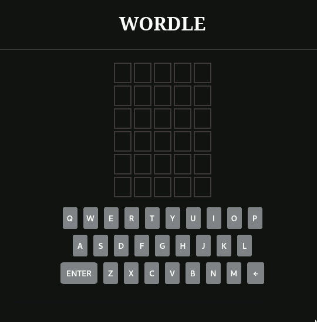

# Wordle clone

## General info
A clone of the popular word game, [Wordle](https://www.nytimes.com/games/wordle/index.html) written in Java + Spring (backend) and Typescript + Angular (frontend).



## Table of contents
* [General info](#general-info)
* [Technologies](#technologies)
* [Setup](#setup)
* [Features](#features)

## Technologies
Project is created with:
* Java 11
* Spring Boot 2.51
* Typescript
* Angular
* PostgreSQL

## Setup
In order to run project locally you need to clone this repository and build project with Docker Compose:

```
$ git clone https://github.com/xpakx/wordle.git
$ cd ladder
$ docker-compose up --build -d
```

To stop:
```
$ docker-compose stop
```

## Features
- [x] Game logic
	- [x] CRON for choosing new words
	- [x] Get proper colors for guess response
- [x] GUI
	- [x] List of guesses
	- [x] Screen keyboard
	- [x] Control with physical keyboard
	- [ ] Animations

